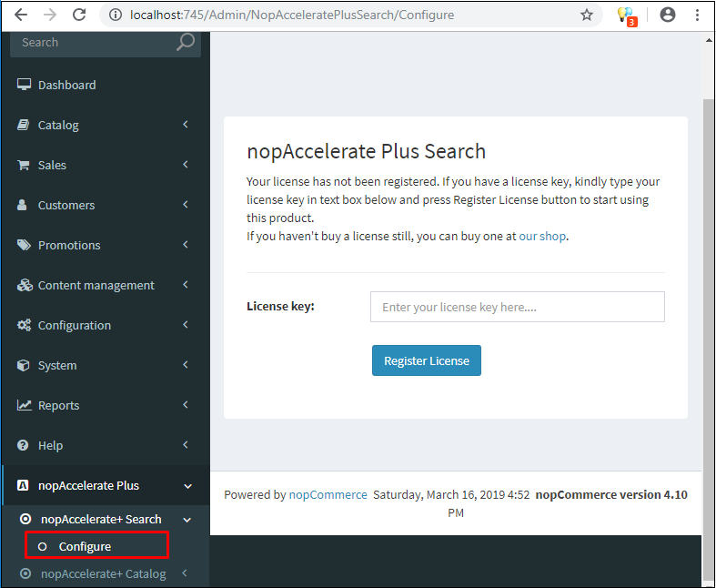

# nopAccelerate Plus Pro Installation

Follow the steps below to install and configure **nopAccelerate Plus Pro** easily:

---

## 1. Install the Plugin

Once you have successfully downloaded the plugin, install it on your nopCommerce store.

---

## 2. Open Plugin Configuration

After installation:

- Go to `Administration > nopAccelerate Plus > nopAccelerate+ Search > Configure`

---

## 3. Add License Keys

- Enter the license keys provided to you via email.
- After successful validation, you will be redirected to the **Getting Started** page.

---

## 4. Getting Started Page – Setup Options

You will be presented with two options to set up **nopAccelerate Plus Pro**:

### 👉 Option 1: Quick Wizard Setup

- Click on the **"Yes"** button.
- This will launch the **Quick Wizard Setup**, which will guide you to install and configure **Solr** and **Java** automatically on your machine.

### 👉 Option 2: Manual Setup

- Click on **"No thanks, I will set up manually"**.
- You will be redirected to the **nopAccelerate Configure** page.
- You must manually set up **Solr** and **Java** on your machine.

> 💡 Refer to the [Java Setup](../java-setup.md) and [Solr Setup](../solr-setup/what-is-solr.md) sections of this documentation for detailed guidance on manual configuration.

---

✅ Once completed, your **nopAccelerate Plus Pro** plugin will be ready to use!
